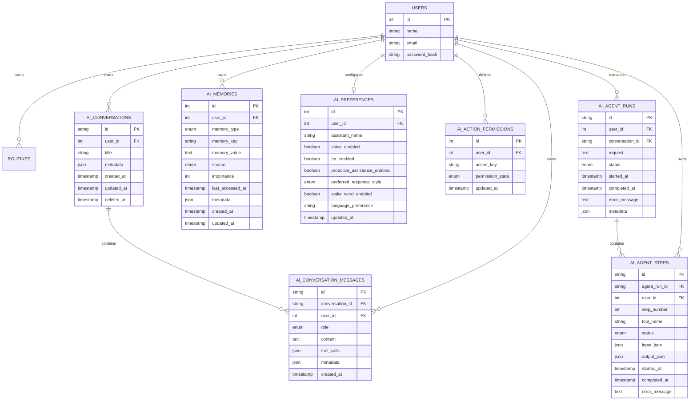

# WellWisher JARVIS AI Database Specification (Phase 1)

---

## 1. Overview
The WellWisher JARVIS AI persistence layer establishes structured, user-scoped relational tables in MySQL to support multi-turn conversations, categorized episodic memory, assistant preferences, user-controlled autonomy permissions, and multi-step agent executions.

---

## 2. Entity Model & Relationship Diagram

---

## 3. Detailed Entity Definitions

### 3.1 `ai_conversations`
- **Purpose**: Groups user–assistant interactions into distinct named sessions.
- **Keys & Constraints**: Primary key `id VARCHAR(64)`. Foreign key `user_id -> users(id)` with `ON DELETE CASCADE`.
- **Soft Deletion**: `deleted_at TIMESTAMP NULL` allows users to clear conversations without immediate hard database wipes.

### 3.2 `ai_conversation_messages`
- **Purpose**: Stores individual conversation turns.
- **Roles Supported**: `'user'`, `'assistant'`, `'system'`, `'tool'`.
- **Tool Calls**: Stored in structured `tool_calls JSON` column to accommodate function calling inputs, outputs, and status.

### 3.3 `ai_memories`
- **Purpose**: Stores long-term user habits, constraints, and preferences.
- **Memory Types**:
  - `USER_PREFERENCE`: Explicit user likes/dislikes.
  - `ROUTINE_PREFERENCE`: Habitual times for workouts, meals, rest.
  - `COMMUNICATION_PREFERENCE`: Verbosity, language tone.
  - `SCHEDULE_PREFERENCE`: Working hours, buffer times.
  - `ASSISTANT_PREFERENCE`: Persona name and voice settings.
  - `TEMPORARY_CONTEXT`: Short-lived context for active workflows.
  - `IMPORTANT_CONTEXT`: High-priority medical or lifestyle constraints.
- **Importance & Scoring**: Integer scale (1 = low, 5 = critical).

### 3.4 `ai_preferences`
- **Purpose**: User configuration for JARVIS.
- **Fields**: `assistant_name` (default: `'JARVIS'`), `voice_enabled`, `tts_enabled`, `proactive_assistance_enabled`, `preferred_response_style`, `wake_word_enabled` (future setting), `language_preference`.

### 3.5 `ai_action_permissions`
- **Purpose**: Strict user-controlled autonomy permissions for JARVIS actions.
- **Permission States**: `ASK_ALWAYS`, `AUTO_APPROVE`, `DISABLED`.
- **Default Safe Matrix**:
  - `create_schedule`: `AUTO_APPROVE`
  - `delete_schedule`: `ASK_ALWAYS`
  - `save_health_data`: `ASK_ALWAYS` (requires preview and approval)
  - `send_family_notification`: `ASK_ALWAYS`

### 3.6 `ai_agent_runs` & `ai_agent_steps`
- **Purpose**: Auditable multi-step agent execution tracker.
- **Statuses**: `PLANNED`, `RUNNING`, `WAITING_FOR_CONFIRMATION`, `COMPLETED`, `FAILED`, `PARTIALLY_COMPLETED`, `CANCELLED`.
- **Step Tracking**: `step_number`, `tool_name`, `input_json`, `output_json`, `status`, `error_message`.

---

## 4. Retention & Privacy Rules
- **User Control**: Users can query, update, and delete individual memories (`AiMemoryRepository.deleteMemory`).
- **Conversation Clearing**: Soft deletion hides conversations from active retrieval (`AiConversationRepository.softDeleteConversation`).
- **Strict User Scoping**: All queries enforce `WHERE user_id = ?` and `FOREIGN KEY (user_id) REFERENCES users(id) ON DELETE CASCADE`.
